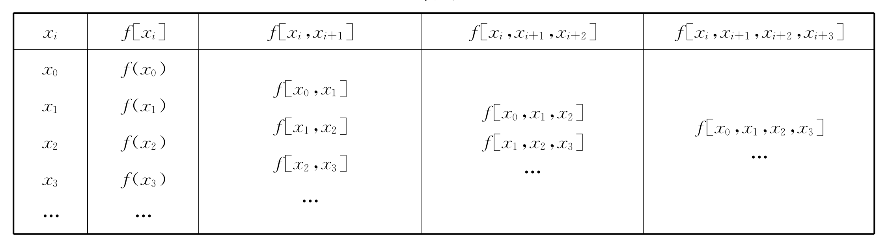

---
tags:
  - computer-science
  - numerical-analysis
---
- **牛顿基本差商公式**
    - **差商**
        - 定义 $f(x)$ 的差商为 $f[x_0,x_1] = \dfrac{f(x_1)-f(x_0)}{x_1-x_0}$。
        - 定义 $f(x)$ 的 $n$ 阶差商为 $f[x_0,\dots,x_n] = \dfrac{f[x_0,\dots,x_{n-1}] - f[x_1,\dots,x_n]}{x_n-x_0}$。
        - 差商中任意几个点的顺序可以随意交换，即 $f[\dots,x_i,\dots,x_j,\dots] = [\dots,x_j,\dots,x_i,\dots]$。
        - 差商可以看作[导数](/notes/docs/mathematics/calculus/derivative)的离散形式。
    - **差商表**
        - 
    - **公式**
        - 牛顿基本差商公式为 $P_n(x) = \displaystyle\sum_{i=0}^{n} f[x_0,\dots,x_i] \prod_{j=0}^{i-1} (x - x_j)$。原函数为 $f(x) = P_n(x) + R_n(x)$。
        - 展开形式：$P_n(x) = f(x_0) + (x - x_0)f[x_0,x_1] + (x - x_0)(x - x_1)f[x_0,x_1,x_2] + \cdots$。
        - 通过差商表计算，各阶差商从差商表的最上斜行得到。
    - **余式**
        - $R_n(x) = f(x) - P_n(x) = f[x_0,\dots,x_n,x]\displaystyle\prod_{i=0}^n(x-x_i)$。
        - 在给定区间中，存在 $\xi$ 使得 $f[x_0,\dots,x_n,x] = \dfrac{f^{(n+1)}(\xi)}{(n+1)!}$，即 $R_n(x) = \dfrac{f^{(n+1)}(\xi)}{(n+1)!}\displaystyle\prod_{i=0}^n(x-x_i)$。
        - 当 $x_0,\dots,x_n$ 趋于同一个值时，$R_n(x)$ 则为[泰勒公式](/notes/docs/mathematics/calculus/taylor-formula)的拉格朗日余式。
        - 在给定区间中，如果 $|f^{(n+1)}(x)|$ 有上界 $M$，则估计 $|R_n(x)| \le \dfrac{M}{(n+1)!}\displaystyle\prod_{i=0}^n(x-x_i)$。
- **牛顿前插 / 后插公式**
    - **差分**
        - 定义 $y=f(x)$ 的差分 $\Delta y=f(x_1)-f(x_0)$，$n$ 阶差分为 $\Delta^{n}y_i = \Delta^{n-1} y_{i+1} - \Delta^{n-1}y_i$。
        - 差分同样可以使用差分表计算，类似差商表。
    - **牛顿前插公式**
        - 当插值节点等距、待求点在插值区间的较前部分时，使用牛顿前插公式比较合适。
        - 设插值节点间距为 $h$，$t = \dfrac{x-x_0}{h}$。
        - $P(x) = \displaystyle\sum_{i=0}^n \dfrac{\Delta^i y_0}{i!h^i} \prod_{j=0}^{i-1}(x-x_j) = \sum_{i=0}^n \binom{t}{i} \Delta^i y_0$。
        - $\Delta^i y_0$ 取差分表的最上斜行。
    - **牛顿后插公式**
        - 类似牛顿前插公式，但待求点在插值区间的较后部分。
        - 设 $t=\dfrac{x - x_n}{h}$，注意与前插公式中的区别。
        - $P(x) = \displaystyle\sum_{i=0}^n \dfrac{\Delta^i y_{n-i}}{i!h^i} \prod_{j=n-i+1}^n (x - x_j) =  \sum_{i=0}^n \binom{t+i-1}{i} \Delta^i y_{n-i}$。
- **拉格朗日公式**
    - **不等距节点公式**
        - $L_n(x) = \displaystyle\sum_{i=0}^n f(x_i) \prod_{j\ne i} \dfrac{x - x_j}{x_i - x_j} = \sum_{i=0}^n f(x_i) a_i(x)$。
        - $a_i(x) = \displaystyle\prod_{j\ne i} \dfrac{x - x_j}{x_i - x_j}$ 称为插值基函数。
            - 对于插值节点，$a_i(x_j) = \left\{\begin{matrix} 1, & i = j \\ 0,& i \ne j \end{matrix}\right.$。
            - $\displaystyle\sum_{i=0}^n a_i(x) = 1$ 恒成立。
    - **舍入误差估计**
        - $|\epsilon| = \displaystyle \left| \sum_{i=0}^n a_i(x)\Delta y_i + y_i\Delta a_i(x) \right| \le \sum_{i=0}^n \left(|a_i(x)| |\Delta y_i| + |y_i| |\Delta a_i(x)|\right)$。
        - 如果 $|\Delta y_i| = |\Delta a_i(x)| = \Delta$，则 $|\epsilon| \le \displaystyle\sum_{i=0}^n (|\Delta y_i| + |\Delta a_i(x)|) \Delta$。
    - **等距节点公式**
        - 已知间距 $h,t=\dfrac{x-x_0}{h}$，$L_n(x) = \displaystyle\sum_{i=0}^n \dfrac{(-1)^{n-i} \prod_{j=0}^n (t-j)}{i!(n-i)!(t-i)} f(x_i)$。
    - **分段线性插值公式**
        - $t = \dfrac{x-x_i}{h}$
        - $L_1(x) = (1-t)f(x_i) + tf(x_{i+1}) = f(x_i) + (f(x_{i+1}) - f(x_0)) t$
        - $|R_1(x)| = \left|\dfrac{f''(\xi)}{2}(x-x_i)(x-x_{i+1})\right| \le \left|\dfrac{M}{2}h^2t(t-1)\right| \le \left|\dfrac{M}{8}h^2\right|$
    - **分段三点插值公式**
        - $t = \dfrac{x-x_i}{h}$
        - $L_2(x) = \dfrac{t^2 - t}{2} y_{i-1} + (1-t^2) y_i + \dfrac{t^2 + t}{2} y_{i+1}$
- **埃尔米特插值公式**
    - **定义**
        - 埃尔米特插值公式根据给定的函数值和一定的[导数](/notes/docs/mathematics/calculus/derivative)值插值，多项式同时满足函数值和导数值条件。
    - **牛顿型**
        - 若 $x_i$ 有 $m_i$ 阶导数作为条件，则在差商表中 $x_i$ 重复 $m_i+1$ 次。
        - 重复 $x_i$ 的差商用导数代替，即 $f[x_i,x_i] = f'(x_i),f[x_i,x_i,x_i]=f''(x_i)$ 等。
        - 除此之外使用牛顿基本差商公式求解。
    - **降阶型**
        - 已知 $n+1$ 个点 $x_0,\dots,x_n$ 的函数值和 $m$ 阶导数，则可得 $p=(m+1)(n+1)-1$ 次多项式。
        - 令 $P_p(x)=L_{n1}(x) + P_{p-(n+1)}(x)\displaystyle\prod_{i=0}^n (x-x_i)$，$P_{p-(n+1)}(x) = L_{n2}(x) + P_{p-2(n+1)}(x)\displaystyle\prod_{i=0}^n (x-x_i)$ 等。
        - 先求 $L_{ni}(x)$，列出 $P_{p-(i-1)(n+1)}(x)=L_{ni}(x) + P_{p-i(n+1)}(x)\displaystyle\prod_{i=0}^n (x-x_i)$，利用已知条件解出 $P_{p-i(n+1)}(x)$ 在各点的函数和各阶导数值。
        - 最终组合各 $L_{ni}(x)$，得插值多项式。
    - **拉格朗日型**
        - 已知 $n+1$点 $x_0,\dots,x_n$ 的函数值和导数，可得 $2n+1$ 次多项式。
        - 令 $P_{2n+1}(x) = \displaystyle\sum_{i=0}^n (\alpha_i(x) y_i + \beta_i(x) y'_i)$，其中 $\alpha_i(x_j) = 1_{i=j},\beta_i(x_j)=0,\beta_i'(x_j)=1_{i=j}$。
        - $l_i(x) = \prod_{j\ne i} \dfrac{x - x_j}{x_i - x_j}$
        - $\alpha_i(x) = \left[1 - 2(x-x_i)\displaystyle\sum_{j\ne i}\dfrac{1}{x_i-x_j}\right]l_i^2(x)$
        - $\beta_i(x) = (x - x_i)l_i^2(x)$
- **反插值**
    - **反函数法**
        - 已知 $y=f(x)$，且存在反函数 $x=f^{-1}(y)$，则可以直接利用普通的方法插值 $f^{-1}$。
    - **正函数法**
        - 已知 $y=f(x)$，在 $[x_0,x_1]$ 中反插值 $y=c \in [y_0,y_1]$。
        - 利用牛顿基本差商公式 $P_n(x)=c$，得出两种迭代公式：
            - $x = x_0 + \dfrac{c - f(x_0)}{f[x_0,x_1]} - \displaystyle\sum_{i=2}\dfrac{f[x_0,\dots,x_i]}{f[x_0,x_1]} \prod_{j=0}^{i-1}(x-x_j) = m_1 + \displaystyle\sum_{i=2}^n m_i \prod_{j=0}^{i-1}(x-x_j)$
            - $x = x_0 + \dfrac{c - f(x_0)}{\displaystyle\sum_{i=1}^n f[x_0,\dots,x_i] \prod_{j=1}^{i-1} (x-x_j)}$
        - 迭代求解的前 $n$ 步中，第 $i$ 步使用迭代公式的和式的前 $i$ 项，之后使用完整的迭代公式。
