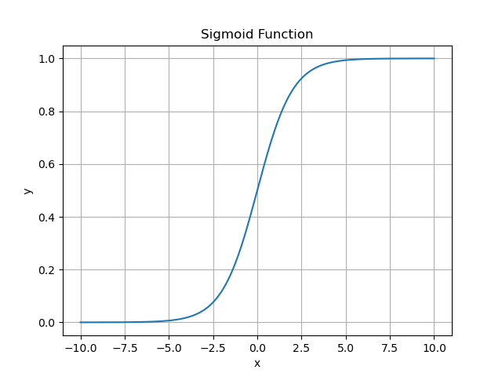

---
tags:
  - artificial-intelligence
  - machine-learning
  - supervised-learning
  - regression
  - classification
---

- **定义**
	- 设 $g(z)=\frac{1}{1+e^{-z}}$，$g(z)$ 被称为 Sigmoid 函数。
	- 以 $\bm x\in\mathrm R^{n+1}$ 为输入（$x_0=1$），以 $\bm\theta\in\mathrm R^{n+1}$ 为参数，定义假设函数 $h_{\bm\theta}(\bm x)=g(\bm\theta^{\mathrm T}\bm x)$。
	- 使用这样的 $h_{\bm\theta}(\bm x)$ 进行回归，称为 Logistic 回归。
	- Logistic 回归虽是回归算法，但实际上是被用于二分类，$h_{\bm\theta}(\bm x)$ 输出可以作为是 $\bm x$ 是阳性的概率。
- **Sigmoid 函数**
	- **图像**
		- 
	- **性质**
		- 值域：$g(z)\in (0,1)$
		- 趋势：$\lim\limits_{z\to -\infty} g(z)=0,\lim\limits_{z\to +\infty} g(z)=1$，只有在 $x=0$ 附近有较大的变化。
		- 特殊点：$g(0)=\frac{1}{2}$
		- 导数：$g'(z)=g(z)(1-g(z))$
	- **Sigmoid 函数与 Logistic 回归的关系**
		- Logistic 回归中的 $h_{\bm\theta}(\bm x)$ 实际上是线性函数 $\bm\theta^{\mathrm T}\bm x$ 与 Sigmoid 函数的复合。
		- 判断 $\bm x$ 是阴性还是阳性是根据 $h_{\bm\theta}(\bm x)$ 的值与 $\frac{1}{2}$ 的关系判断的，即 $\bm\theta^{\mathrm T}\bm x$ 与 $0$ 的关系，所以 $\bm\theta^{\mathrm T}\bm x=0$ 确定了一个线性的决策边界。
- **推导**
	- 假设 $y$ 在 $\bm x$ 条件下的分布为伯努利分布：
	  $$
	  \begin{aligned}
	  P(y=1\mid \bm x;\bm\theta)&=h_{\bm\theta}(\bm x)\\
	  P(y=0\mid \bm x;\bm\theta)&=1-h_{\bm\theta}(\bm x)\\
	  \end{aligned}
	  $$
	- 则可以写出 $y$ 的条件概率密度函数（这里假设 $y$ 可以连续，方便后续的优化过程）：
	  $$
	  p(y\mid\bm x;\bm\theta)=\left(h_{\bm\theta}(\bm x)\right)^y\left(1-h_{\bm\theta}(\bm x)\right)^{1-y}
	  $$
	- 对于训练样本 $(x^{(i)},y^{(i)})$，假设样本满足独立同分布，则：
	  $$
	  \begin{aligned}
	  p(y\mid\bm x;\bm\theta)&=\prod_{i=1}^m p(y^{(i)}\mid\bm x^{(i)};\bm\theta)\\
	  &=\prod_{i=1}^m \left(h_{\bm\theta}(\bm x^{(i)})\right)^{y^{(i)}}\left(1-h_{\bm\theta}(\bm x^{(i)})\right)^{1-y^{(i)}}\\
	  &=\prod_{i=1}^m \exp\left(y^{(i)}\ln h_{\bm\theta}(\bm x^{(i)})+(1-y^{(i)})\ln(1-h_{\bm\theta}(\bm x^{(i)}))\right)\\
	  \end{aligned}
	  $$
	- 训练样本是固定的，$\bm\theta$ 是可变的，所以可以把 $p(y\mid\bm x;\bm\theta)$ 看作是关于 $\bm\theta$ 的函数 $L(\bm\theta)$。
	- 运用最大似然估计，最大化 $L(\theta)$。为了方便，最大化取对数后的 $L(\bm\theta)$：
	  $$
	  \begin{aligned}
	  \ell(\bm\theta)&=\ln L(\bm\theta)\\
	  &=\sum_{i=1}^{m}\left(y^{(i)}\ln h_{\bm\theta}(\bm x^{(i)})+(1-y^{(i)})\ln(1-h_{\bm\theta}(\bm x^{(i)}))\right)\\
	  &=\sum_{i=1}^{m}\left(y^{(i)}\ln g(\bm\theta^{\mathrm T}\bm x)+(1-y^{(i)})\ln(1-g(\bm\theta^{\mathrm T}\bm x))\right)
	  \end{aligned}
	  $$
	- 对 $\ell(\theta)$ 求导：
	  $$
	  \begin{aligned}
	  \frac{\partial}{\partial \theta_j} \ell(\theta) &= \sum_{i=1}^{m}\frac{\partial}{\partial \theta_j}\left(y^{(i)}\ln g(\bm\theta^{\mathrm T}\bm x)+(1-y^{(i)})\ln(1-g(\bm\theta^{\mathrm T}\bm x))\right)\\
	  &= \sum_{i=1}^{m}\left(y^{(i)} \frac{g(\bm\theta^{\mathrm T}\bm x)(1-g(\bm\theta^{\mathrm T}\bm x))}{g(\bm\theta^{\mathrm T}\bm x)}x^{(i)}_j + (1-y^{(i)})\frac{-g(\bm\theta^{\mathrm T}\bm x)(1-g(\bm\theta^{\mathrm T}\bm x))}{1-g(\bm\theta^{\mathrm T}\bm x)}x^{(i)}_j \right)\\
	  &= \sum_{i=1}^{m} \left(y^{(i)}(1-g(\bm\theta^{\mathrm T}\bm x))-(1-y^{(i)})g(\bm\theta^{\mathrm T}\bm x)\right)x^{(i)}_j\\
	  &= \sum_{i=1}^{m} \left(y^{(i)}-h_{\bm\theta}(\bm x^{(i)})\right)x^{(i)}_j
	  \end{aligned}
	  $$
	- 最优的 $\bm\theta$ 就是满足 $\nabla\ell(\bm\theta)=\bm 0$ 的 $\bm\theta$。
- **训练**
	- **梯度上升**
		- Logistic 回归的训练一般使用梯度上升，以下是批量梯度上升的一次迭代对 $\theta_j$ 的更新：
		  $$
		  \begin{aligned}
		  \theta_j &\leftarrow \theta_j + \alpha\sum_{i=1}^m \left(y^{(i)}-g(\bm\theta^{\mathrm T}\bm x^{(i)})\right)x^{(i)}_j\\
		  &=\theta_j + \alpha\sum_{i=1}^m \left(y^{(i)}-h_{\bm\theta}(\bm x^{(i)})\right)x^{(i)}_j
		  \end{aligned}
		  $$
		- 对比[[线性回归]]中 $\theta_j \leftarrow\theta_j-\alpha\sum\limits_{i=1}^m \left(\bm\theta^{\mathrm T}\bm x^{(i)}-y^{(i)}\right)x_j^{(i)}$，如果使用 $h_{\bm\theta}(\bm x^{(i)})$，两者形式上是完全相同的。
		- 这种相似并不是巧合。
	- **牛顿法**
		- 因为最优的 $\bm\theta$ 满足 $\nabla\ell(\bm\theta)=\bm 0$，求出 $\bm\theta$ 的过程可以看作寻找 $\nabla\ell(\bm\theta)$ 的零点。
		- $\bm\theta \leftarrow \bm\theta-H^{-1}\nabla\ell(\bm\theta)$，其中 $H$ 为 $\ell(\bm\theta)$ 的黑塞矩阵，满足
		  $$
		  H_{jk}=\frac{1}{m}\sum_{i = 1}^m x_j^{(i)} x_k^{(i)} g(\bm\theta^T\bm x^{(i)}) (1 - g(\bm\theta^T\bm x^{(i)}))
		  $$
- **预测**
	- 若 $h_{\bm\theta}(\bm x)>\frac{1}{2}$，则 $y=1$，若 $h_{\bm\theta}(\bm x)<\frac{1}{2}$，则 $y=0$。