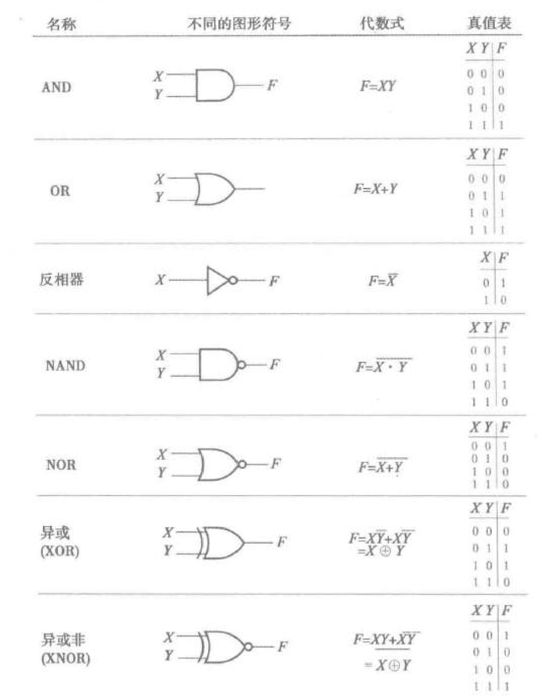

---
tags:
  - computer-science
  - digital-logic
---
- **二值逻辑和逻辑门**
	- **二值逻辑**
		- 参考[命题逻辑](/pages/mathematics/discrete-mathematics/proposition-logic.md)和[布尔代数](/pages/mathematics/discrete-mathematics/lattice.md#l7cahh)。
		- 数字逻辑中的表示与记号：
			- 与：$AB$
			- 或：$A+B$
			- 非：$\overline A$
	- **逻辑门**
		- 
		- 逻辑门具有门延时，电路的时钟一般比其大一两个数量级。
	- **定时图**
		- 定时图的横坐标是时间，纵坐标是 $0$ 或 $1$。
- **布尔代数**
	- **布尔函数**
		- 布尔函数的变量取值为 $0$ 或 $1$，用与、或、非等运算组合表达式。
	- **反函数**
		- 求反函数的方法：
			- 利用德摩根律。
			- 求原函数的对偶式再将每个变量取反。
	- **标准形式**
		- 标准形式是最小项 / [极小项](/pages/mathematics/discrete-mathematics/proposition-logic-calculation.md#nh6buf)的和或最大项 / [极大项](/pages/mathematics/discrete-mathematics/proposition-logic-calculation.md#nh6buf)的积。
		- 最小项之和可以记作 $\sum m(x_1,x_2,\dots)$，最大项之积可以记作 $\prod m(x_1,x_2,\dots)$。
		- 对标准形式进行化简，可以得到积之和和和之积。
- **卡诺图和两级电路优化**
	- **电路的成本标准**
		- 文字成本 L：布尔函数中的文字总数。
		- 门输入成本 G：电路中逻辑门的输入端口总数，不考虑非门。
		- 考虑非门的门输入成本 GN：类似 G，同一个变量的非门只计算一次。
	- **卡诺图**
		- 卡诺图是一个二维表，行和列的头部是变量的格雷码序列。
		- 单元格与最小项对应，将行和列编码组合就得到最小项编号，写在右上角。
		- 布尔函数表示为卡诺图时，所有最小项在对应单元格中写 $1$，其他不写。
