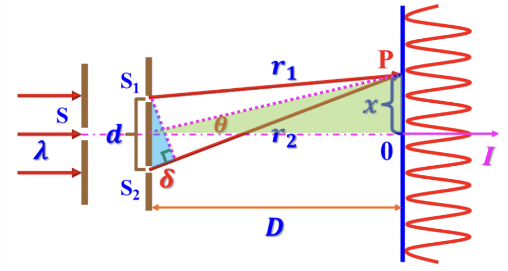

type:: note
tags:: Physics, Optics

- **杨氏双缝干涉**
	- **原理图**
		- 
	- **光程差分布**
		- 亮纹中心： $\delta=\pm k\lambda,k\in \mathrm N^*$
		- 暗纹中心： $\delta=\pm\frac{2k-1}{2}\lambda,k\in \mathrm N^*$
		- 光程差相同的点构成同一条干涉条纹。
		- 相邻两条亮纹或暗纹之间的光程差的变化为 $\lambda$ 。
	- **位置分布**
		- 亮纹中心： $x=\pm k\frac{D}{d}\lambda,k\in\mathrm N^*$
		- 暗纹中心： $x=\pm \frac{2k-1}{2}\frac{D}{d}\lambda,k\in\mathrm N^*$
		- 任意相邻两个条纹之间的距离 $\Delta x=\frac{D}{d}\lambda$ 。